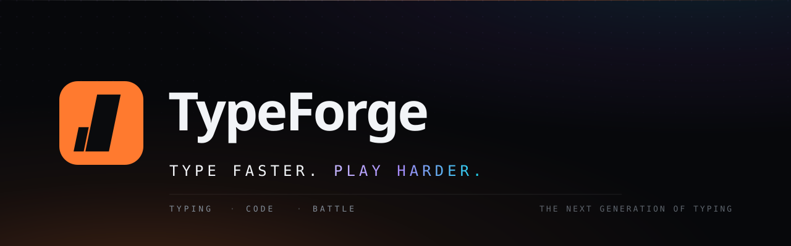
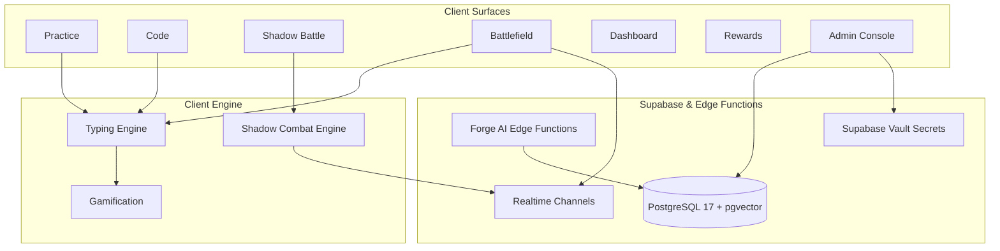

<div align="center">



<br />

# TypeForge

### A typing-performance platform built for people who type for a living.

Most typing sites drill prose and stop there — which is fine until the day your job is
brackets, semicolons and indentation. **TypeForge drills all three, puts you into real-time PvP combat, and coaches you with AI.**

<br />

[](https://react.dev)
[](https://vite.dev)
[](https://tailwindcss.com)
[](https://supabase.com)


<br />

[**Features**](#-features) · [**Shadow Battle**](#-shadow-battle-combat) · [**Admin Console**](#-operator-admin-console) · [**Architecture**](#-architecture) · [**Installation**](#-installation) · [**Shortcuts**](#️-keyboard-shortcuts) · [**Contributing**](#-contributing)

</div>

---

## 🎯 Overview

Typing speed is a developer skill almost nobody trains deliberately. The gap is not prose —
it is `=>`, `::`, `?.`, `{}`, four-space indents and the reach to `;`. Generic typing sites
never touch them.

**TypeForge** closes that gap on four fronts:

| | |
|---|---|
| **Train the hands** | Prose, quotes, row drills and timed sprints with live WPM, accuracy and consistency |
| **Train the syntax** | Real snippets in 11 languages with syntax highlighting, auto-indent, and AI analysis |
| **Test your combat** | **Shadow Battle** — a 2-player real-time fighting game driven by keystroke speed & cadence |
| **Race in the arena** | Real-time multiplayer **Battlefield** races with matchmaking and custom PIN rooms |

Progress lives on your device by default — **no account required, works fully offline**.
Sign in with Google or an anonymous guest account when you want cloud sync across devices.

---

## ✨ Features

### ⌨️ Practice modes

Six shapes for six moods. Every run reports net WPM, accuracy counted across *every*
keypress you ever made, and consistency derived from per-second sampling.

| Mode | What it is |
|:--|:--|
| **Time** | 15 / 30 / 60 / 120-second sprints |
| **Words** | A fixed count — 10 to 100 |
| **Quote** | Memorable lines about craft and focus |
| **Drill** | Target one row: home, top, bottom, numbers, symbols, capitals |
| **Custom** | Paste anything with `Ctrl + V` and drill it immediately |
| **Zen** | No clock, no score, no pressure |

Four difficulty tiers scale vocabulary and punctuation density from *easy* to *expert*.

### 🧩 Code typing

- **11 languages** — JavaScript, TypeScript, Python, Java, C, C++, Go, Rust, Kotlin, Swift, SQL
- **Prism syntax highlighting** underneath the typing state, so colour survives correction
- **Auto-indent** — newlines consume the next line's whitespace, because proving you can
  hold the space bar is not a skill. Brackets are not free.
- **Full-screen focus mode**, with the AI panel still alongside
- **AI-generated snippets** on demand, or step through the bundled library

### ⚔️ Shadow Battle (Combat)

A fighting game powered purely by typing mechanics:
- **3 Lanes**: Strike, Guard, Tech
- **Real-Time Combat Engine**: Resolves attacks, parries, chain combos, focus, and KO windows
- **Intelligent Bot Opponents**: 5 tuned bot archetypes with realistic inter-keystroke intervals (IKI)
- **Ranked Matchmaking & Custom PIN Rooms**: Instant matchmaking or private duels

### 🤖 AI Coaching & Forge AI Engine

- **Analysis Tabs**: Execution flow, complexity cost, code reviews, and contextual chat
- **Edge Runtime**: Multi-provider failover router across serverless Deno edge functions
- **Deterministic Coach Prompts**: Personalized tips derived from your weakest keys and error patterns

### 🛠️ Operator Admin Console (`/admin`)

An enterprise-grade SaaS command center with scoped Role-Based Access Control (RBAC):
- **Overview & KPIs**: Real-time traffic, active users, session throughput, and system health
- **User Management**: Search, filter, inspect profiles, role assignments, and suspension controls
- **AI Control & Rate Limits**: Provider registry, model health, token rates, and Vault secret management
- **Platform Notices**: Push broadcast notifications or targeted alerts with delivery rules
- **Audit Logging**: Fully audited mutations for security and operational compliance

### 📊 Analytics dashboard

- **WPM growth** and **accuracy trend** over 20 / 50 / all runs
- **Practice footprint** — a calendar month you can page back through
- **Skill radar** across speed, accuracy, consistency and volume
- **Keys costing you most** — per-key error rates, with at least 8 attempts recorded
- **Coach's read** — an AI note on what to work on next, with an offline fallback

### 🏆 Gamification

| | |
|:--|:--|
| **XP & levels** | A quadratic curve across 9 named ranks, from *Tapper* to *Phantom* |
| **18 badges** | Four tiers — bronze, silver, gold, legend |
| **Daily missions** | Three per day, picked deterministically so a refresh cannot reroll them |
| **Streaks** | Counted honestly — practise today or yesterday, or it resets |
| **Global Leaderboard** | Live rankings protected by server-side verification |

---

## 🏗 Architecture



---

## 🚀 Installation

**Prerequisites** — Node.js 18+ and npm.

```bash
# 1 · Clone
git clone https://github.com/n4m4n-xd-69/TypeForge.git
cd TypeForge

# 2 · Install
npm install

# 3 · Run
npm run dev          # http://localhost:5173
```

```bash
# Verify build and test suite
npm run verify       # runs build, bundle secret checks, and vitest
```

### Optional configuration

Everything runs with **no configuration at all** — offline content and rule-based fallbacks ensure the app is 100% usable without external keys. To connect cloud features and AI:

```bash
cp .env.example .env.local
```

Configure your Supabase URL and Anon Key in `.env.local` to enable accounts, multiplayer battles, and AI proxying.

---

## ⌨️ Keyboard shortcuts

| Shortcut | Action | Where |
|:--|:--|:--|
| <kbd>Ctrl</kbd>/<kbd>⌘</kbd> + <kbd>K</kbd> | Open quick actions | Anywhere |
| <kbd>Ctrl</kbd>/<kbd>⌘</kbd> + <kbd>\\</kbd> | Collapse / expand sidebar | Anywhere |
| <kbd>Esc</kbd> | Restart the run · leave full screen | Typing surfaces |
| <kbd>⇧</kbd> + <kbd>Tab</kbd> | Load fresh text | Practice |
| <kbd>Ctrl</kbd> + <kbd>⌫</kbd> | Delete the last word | Typing surfaces |
| <kbd>Ctrl</kbd> + <kbd>V</kbd> | Practise pasted text | Practice |
| <kbd>Tab</kbd> | Indent — consumes leading whitespace | Code typing |
| *Any key* | Wakes the typing stage | Typing surfaces |

---

## 🤝 Contributing

Contributions and ideas are welcome. Open an issue or pull request on [GitHub](https://github.com/n4m4n-xd-69/TypeForge/issues) describing **what changed and why**.

---

<div align="center">

**Made with Love** ❤️

<sub>If TypeForge made you faster, a ⭐ helps other developers find it.</sub>

</div>
