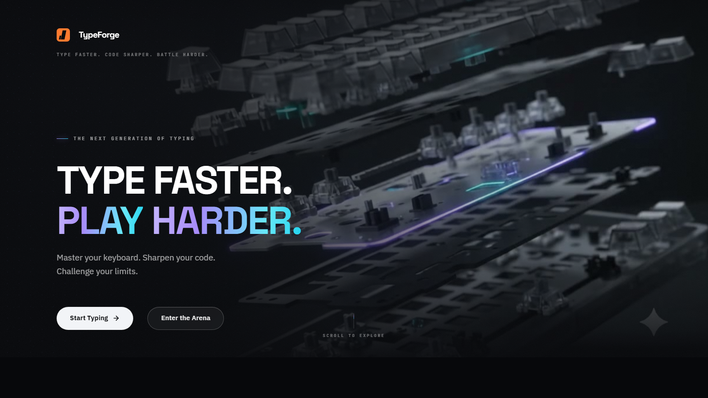
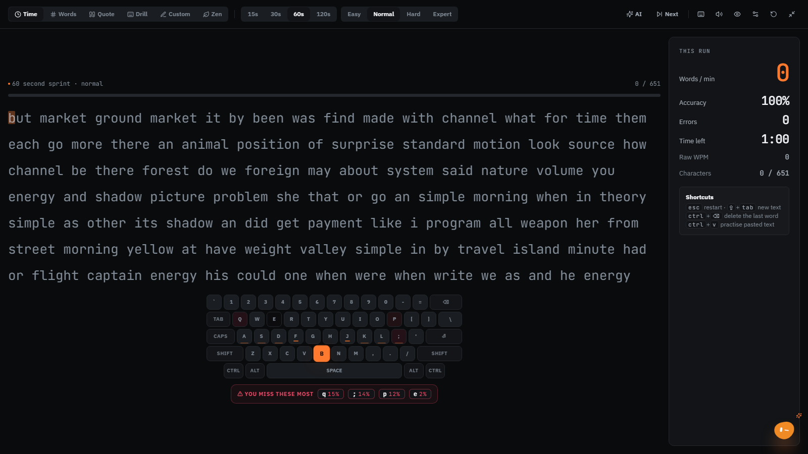
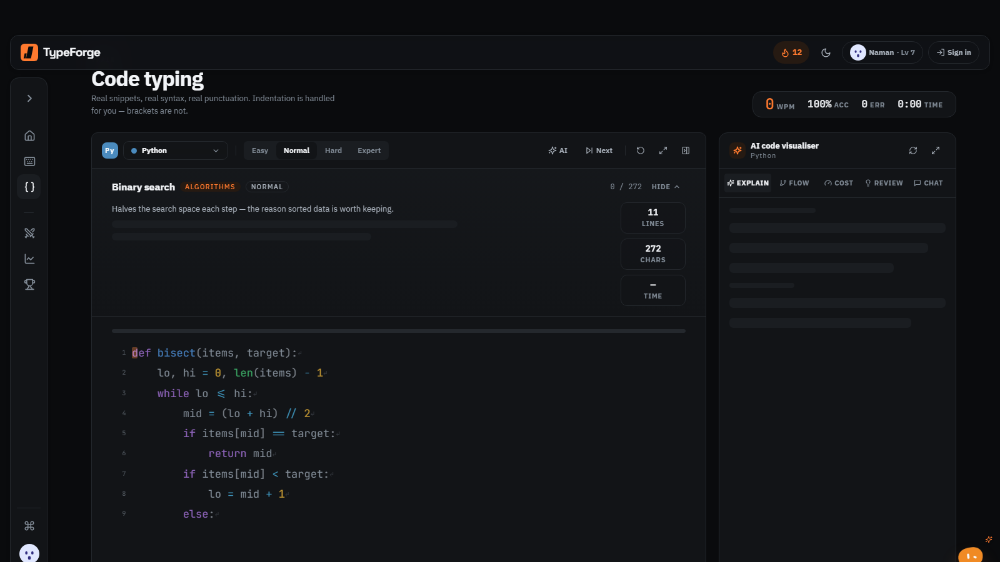
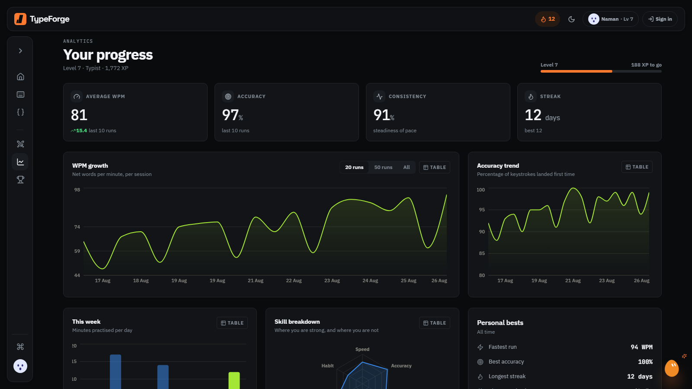
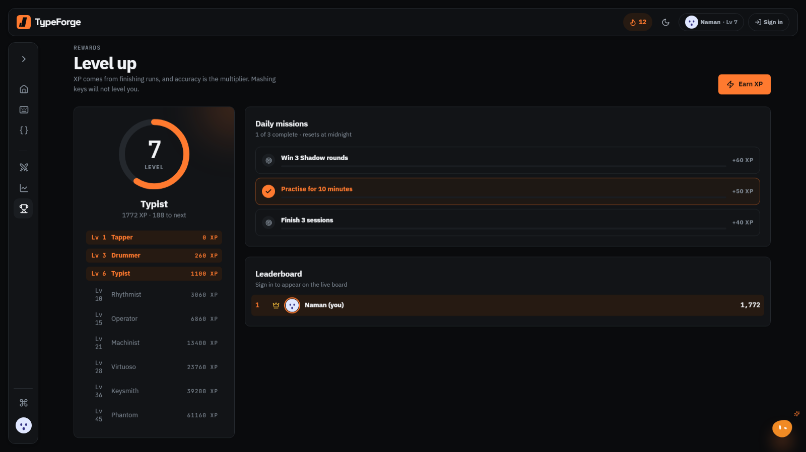
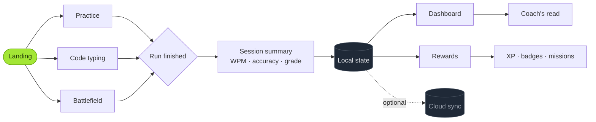
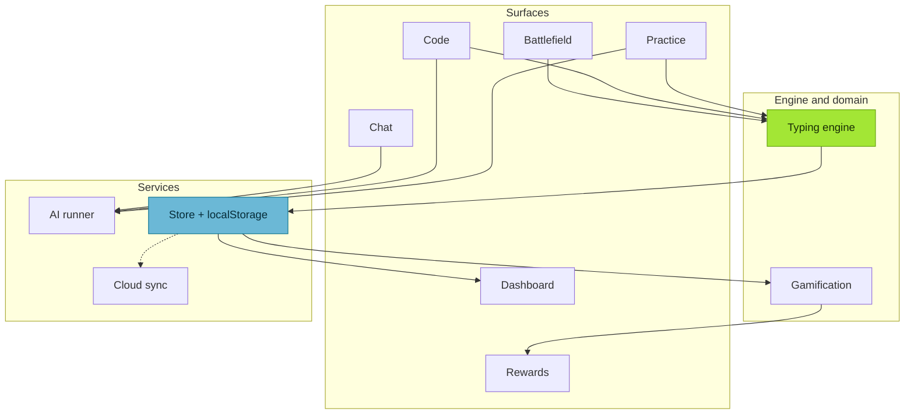

<div align="center">


<br />

# KeyStroke

### A typing trainer built for people who write code.

Most typing sites drill prose and stop there — which is fine until the day your job is
brackets, semicolons and indentation. **KeyStroke drills all three, then teaches the
concepts underneath them.**

<br />

### [**▶ Try it live — key-stroke-ai.vercel.app**](https://key-stroke-ai.vercel.app)

<sub>No sign-up needed. A name is enough to start, and your progress follows you if you add an email.</sub>

<br />

[](https://react.dev)
[](https://vite.dev)
[](https://tailwindcss.com)
[](https://supabase.com)


<br />

[**Live demo**](https://key-stroke-ai.vercel.app) · [**Features**](#-features) · [**Screenshots**](#-screenshots) · [**User journey**](#-user-journey) · [**Architecture**](#-architecture) · [**Setup**](#-installation) · [**Shortcuts**](#️-keyboard-shortcuts) · [**Contributing**](#-contributing)

</div>

---

## 🎯 Overview

Typing speed is a developer skill almost nobody trains deliberately. The gap is not prose —
it is `=>`, `::`, `?.`, `{}`, four-space indents and the reach to `;`. Generic typing sites
never touch them.

**KeyStroke** closes that gap on three fronts:

| | |
|---|---|
| **Train the hands** | Prose, quotes, drills and timed sprints with live WPM, accuracy and consistency |
| **Train the syntax** | Real snippets in 11 languages with syntax highlighting and auto-indent |
| **Test your speed** | Real-time multiplayer Battlefield races with matchmaking and custom PIN rooms |

Progress lives on your device by default — **no account required, works fully offline**.
Sign in only when you want it on more than one machine.

---

## ✨ Features

### ⌨️ Practice modes

Six shapes for six moods. Every run reports net WPM, accuracy counted across *every*
keypress you ever made, and consistency derived from per-second sampling.

| Mode | What it is |
|:--|:--|
| **Time** | 15 / 30 / 60 / 120-second sprints |
| **Words** | A fixed count — 10 to 100 |
| **Quote** | Memorable lines about craft and focus |
| **Drill** | Target one row: home, top, bottom, numbers, symbols, capitals |
| **Custom** | Paste anything with `Ctrl + V` and drill it immediately |
| **Zen** | No clock, no score, no pressure |

Four difficulty tiers scale vocabulary and punctuation density from *easy* to *expert*.

### 🧩 Code typing

- **11 languages** — JavaScript, TypeScript, Python, Java, C, C++, Go, Rust, Kotlin, Swift, SQL
- **Prism syntax highlighting** underneath the typing state, so colour survives correction
- **Auto-indent** — newlines consume the next line's whitespace, because proving you can
  hold the space bar is not a skill. Brackets are not free.
- **Full-screen focus mode**, with the AI panel still alongside
- **AI-generated snippets** on demand, or step through the bundled library

### 🤖 AI analysis panel

A five-tab reading of whatever is on screen, plus a conversation for everything the tabs
cannot answer.

| Tab | Answers |
|:--|:--|
| **Explain** | Step-by-step execution order, naming the exact construct on each line |
| **Flow** | Control flow as a graph, with a concrete value at each step (`i = 0`, `res.ok`) |
| **Cost** | Time and space complexity, and what would change them |
| **Review** | Common mistakes, improvements, and a rewrite on request |
| **Chat** | Free-form, with openers generated from the snippet itself |

### 📊 Analytics dashboard

- **WPM growth** and **accuracy trend** over 20 / 50 / all runs
- **Practice footprint** — a calendar month you can page back through
- **Skill radar** across speed, accuracy, consistency and volume
- **Keys costing you most** — per-key error rates, with at least 8 attempts recorded
- **Coach's read** — an AI note on what to work on next, with an offline fallback

### 🏆 Gamification

| | |
|:--|:--|
| **XP & levels** | A quadratic curve across 9 named ranks, from *Tapper* to *Phantom* |
| **18 badges** | Four tiers — bronze, silver, gold, legend |
| **Daily missions** | Three per day, picked deterministically so a refresh cannot reroll them |
| **Streaks** | Counted honestly — practise today or yesterday, or it resets |
| **Daily challenge** | A fresh target on the landing page |

> **Note** — the leaderboard on the Rewards page shows **demo rivals**, labelled as such in
> the UI. It is a layout placeholder until social features land, not a live ranking.

---

## 📸 Screenshots

<div align="center">

### Landing



<sub>Your day at a glance — level, streak, average WPM, and the two ways in.</sub>

<br /><br />

### Practice



<sub>A freshly generated passage, live stats that ease rather than snap, and a caret that
tracks the line you are on.</sub>

<br /><br />

### Code typing



<sub>Binary search with worked examples, complexity, and a seven-step execution reading —
all generated for the snippet in front of you.</sub>

<br /><br />

### Dashboard



<sub>Six weeks of history: growth, accuracy, consistency, and the streak behind them.</sub>

<br /><br />

### Rewards



<sub>The level ladder, today's three missions, and 18 badges across four tiers.</sub>

</div>

---

## 🗺 User journey



**How it flows.** Everything starts at the landing page, which reads your current state and
points at the shortest useful next action. Practice, Code, and Battlefield all end in a scored session
that writes to local state. Dashboard and Rewards are pure readers of that state — they compute, never store.
Cloud sync mirrors it when you are signed in, and is a no-op when you are not.

---

## 🏗 Architecture



| Module | Responsibility |
|:--|:--|
| **Typing engine** | Keystrokes on `keydown`, not through an `<input>` — so Enter, Tab and Backspace behave predictably and code can auto-consume indentation. Counters live in refs; only what renders lives in state. |
| **Gamification** | Pure functions over saved state, so XP, level and streak recompute identically on any device. |
| **AI integration** | Provider priority with **hedged failover** — the next attempt starts while the previous is still running, so a slow model costs a hedge delay rather than a full timeout. Every helper degrades to a local reading instead of throwing. |
| **Charts** | Recharts, one measure per chart. Two measures of different scale get two charts, because a second y-axis is a lie about shared scale. |
| **Theming** | Light / dark / system, resolved before first paint so there is never a flash of the wrong mode. |
| **Accessibility** | See [below](#-accessibility). |

---

## 🚀 Installation

**Prerequisites** — Node.js 18+ and npm.

```bash
# 1 · Clone
git clone https://github.com/n4m4n-xd-69/Key-Stroke.git
cd Key-Stroke

# 2 · Install
npm install

# 3 · Run
npm run dev          # http://localhost:5173
```

```bash
npm run build        # production bundle -> dist/
npm run preview      # serve the built bundle locally
```

### Optional configuration

Everything runs with **no configuration at all** — AI features switch themselves off and the
app stays fully usable. To enable them, copy `.env.example` to `.env.local`:

```bash
cp .env.example .env.local
```

| Variable | Enables |
|:--|:--|
| `VITE_HCNSEC_KEY` | Primary AI provider |
| `VITE_OPENROUTER_KEY` | Fallback AI provider |
| `VITE_SUPABASE_URL` · `VITE_SUPABASE_ANON_KEY` | Accounts and cloud sync |
| `VITE_SITE_URL` | Attribution referer for OpenRouter |

> ⚠️ Anything prefixed `VITE_` is **inlined into the client bundle** and readable by anyone
> who loads the site. That is the trade-off for a static deploy with no backend — use
> spend-limited keys, and move to a serverless proxy before going public in earnest.

### Regenerating generated assets

```bash
node scripts/build-icons.mjs    # Logo.jsx -> favicon, PWA icons
```

---

## 📁 Project structure

```
Key-Stroke/
├── assets/                    # Banner and screenshots for this README
├── scripts/
│   └── build-icons.mjs        # Derives every icon from one logo shape
├── supabase/migrations/       # Schema and row-level security
├── src/
│   ├── components/
│   │   ├── brand/             # Logo — the single source of the mark
│   │   ├── charts/            # Recharts wrappers, palette, frames
│   │   ├── layout/            # AppShell, command palette, chat FAB
│   │   ├── typing/            # Engine, stage, keyboard visualiser, summary
│   │   └── ui/                # Button, Modal, Select, Markdown, Toast…
│   ├── lib/
│   │   ├── ai.js              # Prompts, JSON contracts, offline fallbacks
│   │   ├── ai-runner.js       # Transport: priority, hedging, streaming
│   │   ├── store.jsx          # Reducer + localStorage persistence
│   │   ├── sync.js            # Cloud mirror (no-ops when signed out)
│   │   ├── typing.js          # WPM, accuracy, consistency, key mapping
│   │   └── gamification.js    # XP, levels, streaks, badges, missions
│   └── modules/
│       ├── practice/  code/  battle/  dashboard/
│       └── achievements/  chat/  about/  auth/  admin/
└── vite.config.js
```

---

## ⌨️ Keyboard shortcuts

| Shortcut | Action | Where |
|:--|:--|:--|
| <kbd>Ctrl</kbd>/<kbd>⌘</kbd> + <kbd>K</kbd> | Open quick actions | Anywhere |
| <kbd>Ctrl</kbd>/<kbd>⌘</kbd> + <kbd>\\</kbd> | Collapse / expand sidebar | Anywhere |
| <kbd>Esc</kbd> | Restart the run · leave full screen | Typing surfaces |
| <kbd>⇧</kbd> + <kbd>Tab</kbd> | Load fresh text | Practice |
| <kbd>Ctrl</kbd> + <kbd>⌫</kbd> | Delete the last word | Typing surfaces |
| <kbd>Ctrl</kbd> + <kbd>V</kbd> | Practise pasted text | Practice |
| <kbd>Tab</kbd> | Indent — consumes leading whitespace | Code typing |
| *Any key* | Wakes the typing stage | Typing surfaces |

---

## ♿ Accessibility

Considered throughout, not retrofitted:

- **Semantic landmarks** — `<header>`, `<nav>`, `<main>`, `<aside>`, plus a skip-to-content link
- **Full keyboard operation** — including a custom `<Select>` with type-ahead, roving focus,
  <kbd>Home</kbd>/<kbd>End</kbd> and <kbd>Esc</kbd>, because the native control's popup cannot be styled
- **Reduced motion** — every animation checks `prefers-reduced-motion`, including the live
  WPM counter, which snaps instead of easing
- **Charts** — legends, axis labels, and a **table view** toggle, so data is never colour-only
- **Modals** — focus trapped on open and restored on close, <kbd>Esc</kbd> dismisses, and an
  open dialog always wins the keyboard over background surfaces
- **Contrast** — pending text sits at full `--ink-3`; a faded tint dropped below 3:1 and was
  genuinely hard to read ahead of the caret
- **Decorative elements** are `aria-hidden`, so the tagline animation is never announced

---

## 🧠 AI integration

Two providers, ordered by priority, with **hedged failover**: attempt *N* starts a few
seconds after attempt *N−1* rather than waiting for it to fail, so a slow model costs a
hedge delay instead of a full timeout. The first usable answer wins, and every other
in-flight request is aborted.

Model order is tuned against the **real workload**, not a ping — the ranking inverts between
a 20-token completion and a 2,200-token analysis, and ranking by the short one put the
slowest model first.

**Everything degrades rather than breaks:**

| Feature | Without AI |
|:--|:--|
| Practice text | Falls back to the bundled word banks and quote library |
| Code analysis | A locally computed reading from the source text, labelled as such |
| Suggested questions | Derived locally from the snippet's structure |
| Coach's read | A rule-based note from your own statistics |
| Chat and tutor | Clearly disabled, with the reason stated |

Worked examples are deliberately **absent** offline: running a snippet is the only honest
way to know what it prints, and inventing plausible output for a learner to trust would be
worse than showing nothing.

---

## 🤝 Contributing

Contributions and ideas are welcome. Open an issue or pull request describing **what changed and why**.

---

## 📄 License

License to be determined. Until one is added, all rights are reserved by the author.

## 🙏 Acknowledgements

Built with [React](https://react.dev), [Vite](https://vite.dev),
[Tailwind CSS](https://tailwindcss.com), [Framer Motion](https://motion.dev),
[Recharts](https://recharts.org), [Prism](https://prismjs.com),
[Lucide](https://lucide.dev) and [Supabase](https://supabase.com).

---

<div align="center">

**Made with Love** ❤️

<sub>If KeyStroke made you faster, a ⭐ helps other developers find it.</sub>

</div>
